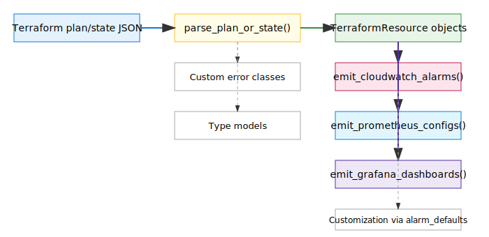

# terraform_observability_pack

Generate opinionated CloudWatch/Prometheus/Grafana monitoring modules from Terraform tags and outputs.

## Installation

```bash
pip install terraform_observability_pack
```

## Quick Start

```python
from terraform_observability_pack import TerraformObservabilityPack

instance = TerraformObservabilityPack()
result = instance.run()
print(result)
```

## Features

- Parse Terraform plan/state to discover resources and labels

## Architecture

<p align="center">
  
</p>
<sub><i>See below for a text-based (Mermaid) version.</i></sub>

The SDK is structured as a minimal, importable Python library with a clear, type-annotated API. Its core flow is:

```mermaid
flowchart TD
    A[Terraform plan/state JSON<br/>(input as dict)] --> B[parse_plan_or_state()]
    B --> C[TerraformResource objects<br/>(normalized resources)]
    C --> D[emit_cloudwatch_alarms()<br/>(CloudWatch alarm JSON)]
    C --> E[emit_prometheus_configs()<br/>(Planned)]
    C --> F[emit_grafana_dashboards()<br/>(Planned)]
    B -.-> G[Custom error classes<br/>(exceptions.py)]
    B -.-> H[Type models<br/>(types.py)]
    D -.-> I[Customization via alarm_defaults]
```

1. **Input**: Accepts Terraform plan or state JSON (as Python dicts).
2. **Parsing**: Extracts resources, instances, and tags/labels using `parse_plan_or_state`. Handles multiple instances per resource.
3. **Resource Modeling**: Normalizes resources into `TerraformResource` objects (see `types.py`).
4. **Emission**: Generates monitoring artifacts:
   - CloudWatch alarms (JSON, via `emit_cloudwatch_alarms`)
   - (Planned: Prometheus scrape configs, Grafana dashboards)
5. **Customization**: Allows alarm/dashboard customization via function arguments (e.g., `alarm_defaults`).

**Main modules:**
- `parse_terraform_planstate_to_d.py`: Parsing and emission logic
- `types.py`: Public types and data models
- `exceptions.py`: Custom error classes
- `_utils.py`: Internal helpers (not public API)

**Design principles:**
- Minimal, intuitive API surface (see below)
- All public functions/classes have docstrings and type hints
- No side effects on import; no global state
- Errors are descriptive and use custom exceptions
- Extensible for new resource types and monitoring targets


- Handles multiple resource instances (e.g., for ASGs, Lambda, etc.)
- Emit ready-to-apply CloudWatch alarms and dashboard JSON
  - Use `emit_cloudwatch_alarms()` to generate CloudWatch alarm JSON for supported AWS resources
  - Supported resource types: EC2, S3, RDS, DynamoDB, Lambda, ELB/ALB/NLB, Auto Scaling Group, SNS, SQS
- Generate Prometheus scrape configs and Grafana dashboard templates
- Tag-to-alert-rule mapping with override files

## API Reference

### `TerraformObservabilityPack`

#### Constructor

```python
TerraformObservabilityPack(options: TerraformObservabilityPackOptions | None = None)
```

#### Instance Handling

When parsing Terraform state files, resources with multiple instances (such as Auto Scaling Groups or Lambda functions) will be represented as multiple `TerraformResource` objects, one per instance. Each instance's tags/labels are extracted individually.

**Example:**

```python
state = {
    "resources": [
        {
            "type": "aws_autoscaling_group",
            "name": "asg",
            "address": "aws_autoscaling_group.asg",
            "instances": [
                {"attributes": {"tags": {"Name": "asg-1"}}},
                {"attributes": {"tags": {"Name": "asg-2"}}}
            ]
        }
    ]
}
pack = TerraformObservabilityPack()
result = pack.parse_plan_or_state(state)
for r in result.resources:
    print(r.type, r.name, r.labels)
# Output:
# aws_autoscaling_group asg {'Name': 'asg-1'}
# aws_autoscaling_group asg {'Name': 'asg-2'}
```

#### Methods

- `run()` - Execute the main operation. Returns `TerraformObservabilityPackResult`.
- `emit_cloudwatch_alarms(resources, alarm_defaults=None)` - Emit ready-to-apply CloudWatch alarm JSON for supported resources.

##### Example: Emit CloudWatch alarms

```python
from terraform_observability_pack import TerraformObservabilityPack

instance = TerraformObservabilityPack()
plan = { ... }  # Terraform plan or state JSON
result = instance.parse_plan_or_state(plan)
alarms = instance.emit_cloudwatch_alarms(result.resources)
for alarm in alarms:
    print(alarm)

# Example output for RDS, Lambda, SNS, and SQS:
# {
#   "AlarmName": "db-1-RDS-HighCPU",
#   "AlarmDescription": "High CPU for RDS db-1 (aws_db_instance.db[0])",
#   "Namespace": "AWS/RDS",
#   "MetricName": "CPUUtilization",
#   "Dimensions": [{"Name": "DBInstanceIdentifier", "Value": "db-1"}],
#   ...
# }
# ...
```

#### Alarm Customization

You can customize the generated CloudWatch alarms by passing an `alarm_defaults` dictionary to `emit_cloudwatch_alarms`. This dictionary sets default values for all generated alarms (e.g., thresholds, periods, actions). Any keys in `alarm_defaults` will override the SDK’s built-in defaults for every alarm.

**Example: Customizing alarm thresholds and actions**

```python
custom_defaults = {
    "Threshold": 80.0,
    "EvaluationPeriods": 2,
    "AlarmActions": ["arn:aws:sns:us-east-1:123456789012:my-topic"],
    "TreatMissingData": "breaching"
}
alarms = instance.emit_cloudwatch_alarms(result.resources, alarm_defaults=custom_defaults)
for alarm in alarms:
    print(alarm)
```

You can set any valid CloudWatch alarm property (see [AWS docs](https://docs.aws.amazon.com/AmazonCloudWatch/latest/APIReference/API_PutMetricAlarm.html)).
To override properties for specific alarms or resource types, post-process the returned alarm list in your code.

## Development

```bash
# Install with dev dependencies
make install

# Run tests
make test

# Lint and type-check
make lint

# Format code
make format

# Build
make build
```

## Publishing

1. Update version in `pyproject.toml` and `src/terraform_observability_pack/__init__.py`
2. Create a GitHub release with tag `v0.x.0`
3. The GitHub Action will automatically publish to PyPI

## License

MIT
